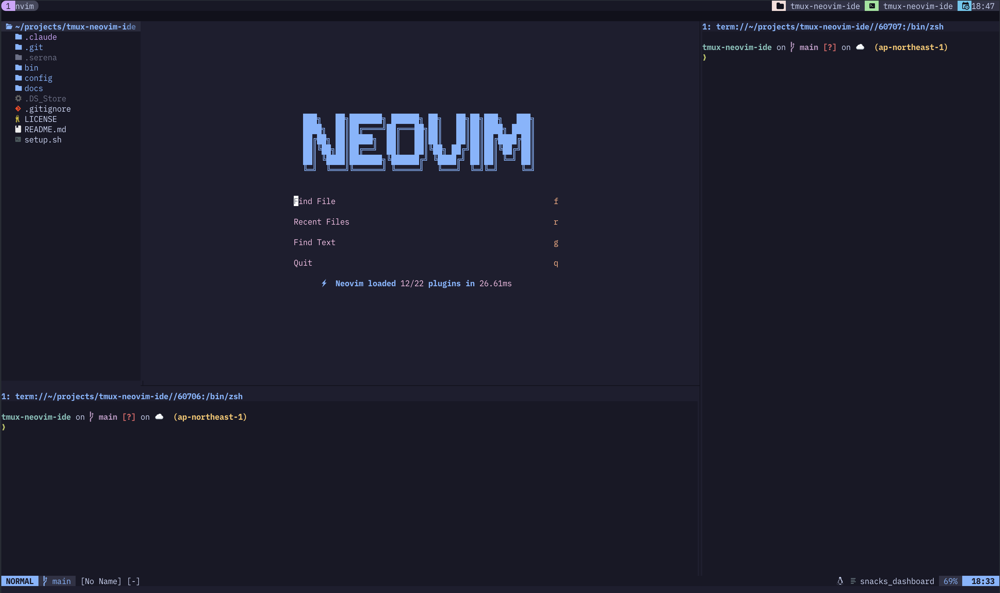

# tmux-neovim-ide

Ghostty + tmux + Neovim で VSCode ライクなターミナル IDE を構築するための設定ファイル一式。

Cmd+P でファイル検索、Cmd+Shift+F でプロジェクト内検索、Cmd+B でサイドバー切り替え。
VSCode のキーバインドがそのまま使える。

## スクリーンショット



## 必要なもの

- macOS
- [Homebrew](https://brew.sh)
- [Ghostty](https://ghostty.org)（Cmd キーパススルーに必要）
- [PlemolJP Console NF](https://github.com/yuru7/PlemolJP)（フォント。他の Nerd Font でも可）

## セットアップ

```bash
git clone https://github.com/s0ar/tmux-neovim-ide.git ~/tmux-neovim-ide
cd ~/tmux-neovim-ide
./setup.sh
```

既にツールがインストール済みの場合：

```bash
./setup.sh --config-only
```

セットアップスクリプトは以下を行います：

1. `brew install` でツールをインストール（neovim, tmux, fzf, fd, ripgrep, ghostty）
2. 既存の設定ファイルをバックアップ
3. シンボリックリンクで設定を配置
4. PATH に `~/.local/bin` を追加

## 使い方

```bash
ide
```

fzf で `~/projects` 配下のプロジェクトを選択すると、tmux セッションが作成されて Neovim が IDE モードで起動します。

## キーバインド

### VSCode ライクなキーバインド（Cmd キー）

| キー | 機能 |
|------|------|
| `Cmd+P` | ファイル検索 |
| `Cmd+Shift+F` | プロジェクト内テキスト検索 |
| `Cmd+Shift+P` | コマンドパレット |
| `Cmd+B` | サイドバー（Neo-tree）切り替え |
| `Cmd+/` | コメントトグル |
| `` Cmd+` `` | 下部ターミナル切り替え |
| `Cmd+J` | 右側ターミナル切り替え |
| `Cmd+Shift+J` | フローティングターミナル |

### Neovim キーバインド

| キー | 機能 |
|------|------|
| `Space` | Leader キー |
| `Ctrl+h/j/k/l` | ウィンドウ/tmuxペイン移動 |
| `Shift+H/L` | 前/次のタブ |
| `Alt+J/K` | 行の上下移動 |
| `gd` | 定義へジャンプ |
| `gr` | 参照一覧 |
| `K` | ホバードキュメント |
| `F2` | リネーム |
| `Space+ff` | ファイル検索 |
| `Space+fg` | テキスト検索 |

### tmux

| キー | 機能 |
|------|------|
| `Ctrl+B` | Prefix |
| `Prefix + c` | 新しいウィンドウ |
| `Prefix + \|` | 縦分割 |
| `Prefix + -` | 横分割 |

## アーキテクチャ

```
Ghostty (Cmd キーをエスケープシーケンスに変換)
  └─ tmux (user-keys で受け取り CSI u 形式に変換)
       └─ Neovim (<D-*> マッピングで各機能に割り当て)
```

## ディレクトリ構造

```
tmux-neovim-ide/
├── setup.sh                          # セットアップスクリプト
├── config/
│   ├── tmux.conf                     # → ~/.tmux.conf
│   ├── ghostty/
│   │   └── config                    # → ~/Library/Application Support/com.mitchellh.ghostty/config
│   └── nvim/                         # → ~/.config/nvim/
│       ├── init.lua
│       └── lua/plugins/
│           ├── bufferline.lua
│           ├── colorscheme.lua
│           ├── completion.lua
│           ├── fzf.lua
│           ├── git.lua
│           ├── indent.lua
│           ├── lsp.lua
│           ├── lualine.lua
│           ├── navigation.lua
│           ├── neo-tree.lua
│           ├── toggleterm.lua
│           ├── treesitter.lua
│           └── which-key.lua
└── bin/
    └── ide                           # → ~/.local/bin/ide
```

## 関連記事

- [【コピペで動く】tmux + Neovimで作るVSCodeライクなターミナル開発環境](https://zenn.dev/s0ar/articles/fd6203970ba0fe)
- [【コピペで動く】Zellij + Helixで作る軽量ターミナル開発環境](https://zenn.dev/s0ar/articles/192a58e9177961)

## ライセンス

MIT
